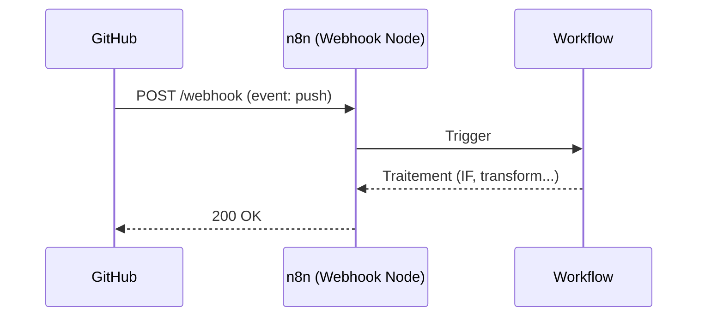

## 🔔 À propos de ce repo

> Ce repo sert de bac à sable pour comprendre le mécanisme des **webhooks**.

### 📡 Concept clé
| Terme | Définition |
|---|---|
| **Webhook** | URL à l'écoute passive, déclenchée par un événement externe (push) |
| **Payload** | Données JSON envoyées par GitHub lors de l'événement |
| **Trigger** | Point d'entrée qui démarre le workflow n8n |

### ✅ Test effectué
- [x] Configuration du node `Webhook` sur n8n
- [x] Ajout du webhook dans `Settings > Webhooks` du repo
- [x] Réception du `ping` initial
- [x] Commit test → réception de l'event `push`

---
*Made while learning n8n 🛠️*
