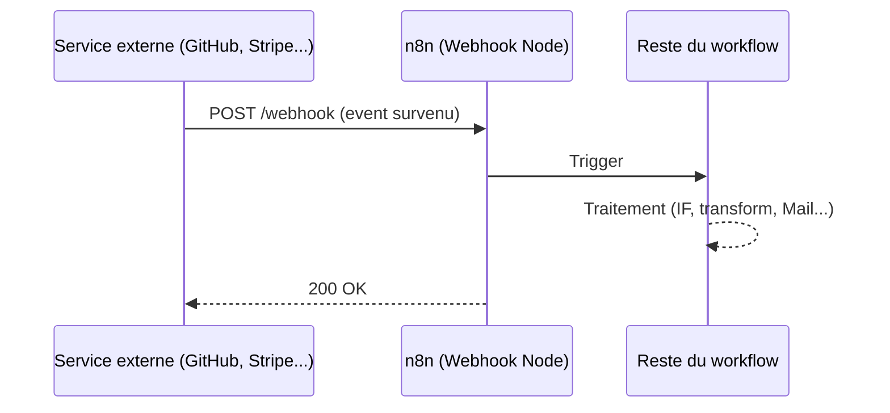

# 🔔 Comprendre les Webhooks dans n8n

## Concept de base

Un **webhook** est une URL générée par n8n qui reste **en écoute passive**. Contrairement à un appel API classique où tu vas chercher l'info (`GET`), ici c'est le service externe (GitHub, Stripe, etc.) qui **pousse** la donnée vers ton URL dès qu'un événement se produit.

| | Webhook (push) | Polling (pull) |
|---|---|---|
| Qui initie la requête ? | Le service externe | n8n lui-même |
| Méthode HTTP typique | `POST` | `GET` |
| Déclenchement | En temps réel, à l'événement | À intervalle régulier (Schedule Trigger) |
| Coût réseau | Faible (rien tant qu'il n'y a pas d'event) | Plus élevé (requêtes répétées) |

## Schéma du flux



## Deux URLs distinctes dans n8n

- **Test URL** (`/webhook-test/...`) : active uniquement pendant que tu cliques sur *"Listen for test event"*. Pratique pour observer un payload une seule fois pendant le développement.
- **Production URL** (`/webhook/...`) : active en continu, mais seulement une fois le workflow **activé** (toggle "Active").

## Exposer un localhost au public : ngrok

n8n tournant en local (`localhost:<PORT>`, par défaut `5678`) n'est pas atteignable depuis internet. **ngrok** crée un tunnel HTTPS public temporaire qui redirige vers ce port :

```bash
ngrok http <PORT>
```

Points clés :
- L'URL générée (`https://<SOUS_DOMAINE_ALEATOIRE>.ngrok-free.dev`) change à chaque nouvelle session (plan gratuit).
- Le tunnel reste actif tant que le processus `ngrok` tourne dans le terminal.
- Le token d'authentification ne se configure qu'une seule fois (`ngrok config add-authtoken ...`).

## `ping` vs `push` : ne pas confondre

Quand tu ajoutes un webhook sur GitHub, un événement `ping` est envoyé automatiquement pour valider la connexion — **ce n'est pas encore ton commit**.

| Signature | `ping` | `push` |
|---|---|---|
| Champ `zen` | ✅ présent | ❌ absent |
| Champ `commits[]` | ❌ absent | ✅ présent |
| Header `x-github-event` | `ping` | `push` |

## Content-Type : un détail qui change tout

- `application/x-www-form-urlencoded` → le JSON arrive **encapsulé** dans un seul champ texte `payload`, difficile à exploiter directement.
- `application/json` → le JSON arrive **structuré**, directement accessible via `$json.body....`

## Accéder aux données dans une expression n8n

Structure du payload `push` (simplifiée) :

```
body
├── ref                → nom de la branche (ex: "refs/heads/main")
├── pusher.name         → auteur du push
├── head_commit
│   ├── id              → hash du dernier commit
│   ├── message         → titre du dernier commit
│   ├── timestamp
│   └── modified[]      → fichiers modifiés (tableau)
└── commits[]           → tableau de TOUS les commits du push
```

⚠️ **Limite importante** : `head_commit` ne donne accès qu'**au dernier commit** du push. Si plusieurs commits sont poussés d'un coup, il faut boucler sur `commits[]` (ex: via un node `Split Out`) pour traiter chacun individuellement — sinon un seul mail/notification sera généré pour tout le push.

## Résumé du workflow testé

```
GitHub (push sur repo)
   ↓ POST
ngrok (tunnel public → localhost:<PORT>)
   ↓
n8n Webhook Node (capture le payload)
   ↓
n8n Mail Node (notification avec titre du commit, auteur, fichiers modifiés...)
```
> Testé et documenté par [@Youssef-Ait-Said](https://github.com/Youssef-Ait-Said) — septembre 2026.
